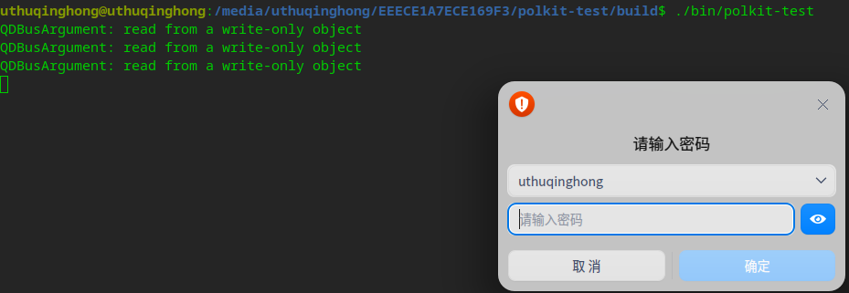
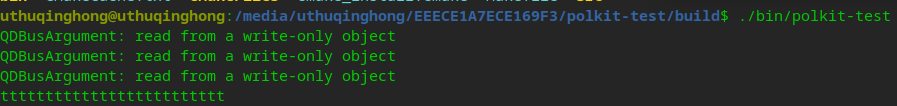

# 原理

This is a demo for polkit.

演示polkitqsqlit 使用。

# 使用方式

sudo apt install libpolkit-qt5-1-dev libpolkit-agent-1-dev

libdbus-1-dev是其它项目迁移过来的库，如果不用，可以在CMakeLists中去掉。

sudo cp com.polkit.qt.example.policy /usr/share/polkit-1/actions/

mkdir build

cd build

rm -rf ./* && cmake .. && make -j

# 测试结果

该弹窗是阻塞的，输入密码后，终端输出如下：

# 参考文档

https://www.jianshu.com/p/aeb7f2f736a2

[https://github.com/xiayesuifeng/polkit-qt-example]()

[https://github.com/KDE/polkit-qt-1/tree/master/examples]()

polkit 官网中文翻译网址

[https://wiki.archlinux.org/title/Polkit_(%E7%AE%80%E4%BD%93%E4%B8%AD%E6%96%87)]()
